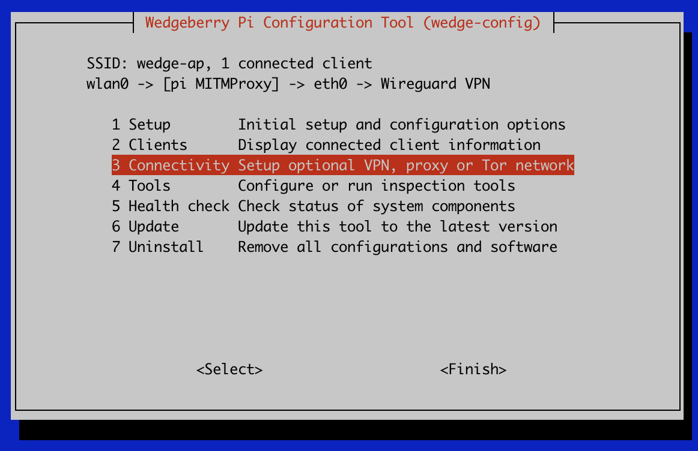

# wedgeberry
Wedgeberry is a single script that provides an interactive menu to configure a Raspberry Pi into a Wifi transparent proxy to support traffic inspection and tampering.



Currently the following can be configured via the `wedge-config` interactive menu:

- Wifi access point with DHCP 
- Mitmproxy as transparent proxy 
- Routing all outbound traffic via Wireguard VPN tunnel
- Forward TCP ports (and DNS) via the Tor network
- Forward TCP ports to external interception proxy (BurpSuite) 

The script was motivated by the Raspberry Pi `raspi-config` tool which provides an accessible way to configure a Pi. Here we provide an easy and quick way to configure a Pi into a Wifi access point that supports various traffic forwarding options along with common tooling for IoT / mobile device security research / testing.

# Installation

From a Raspberry Pi:
```
wget https://github.com/haxrob/wedgeberry/..
sudo ./wedge-config.sh
```

Note, to build `wedge-config.sh` from this repository, run `make` to generate `./wedge-config.sh`

 